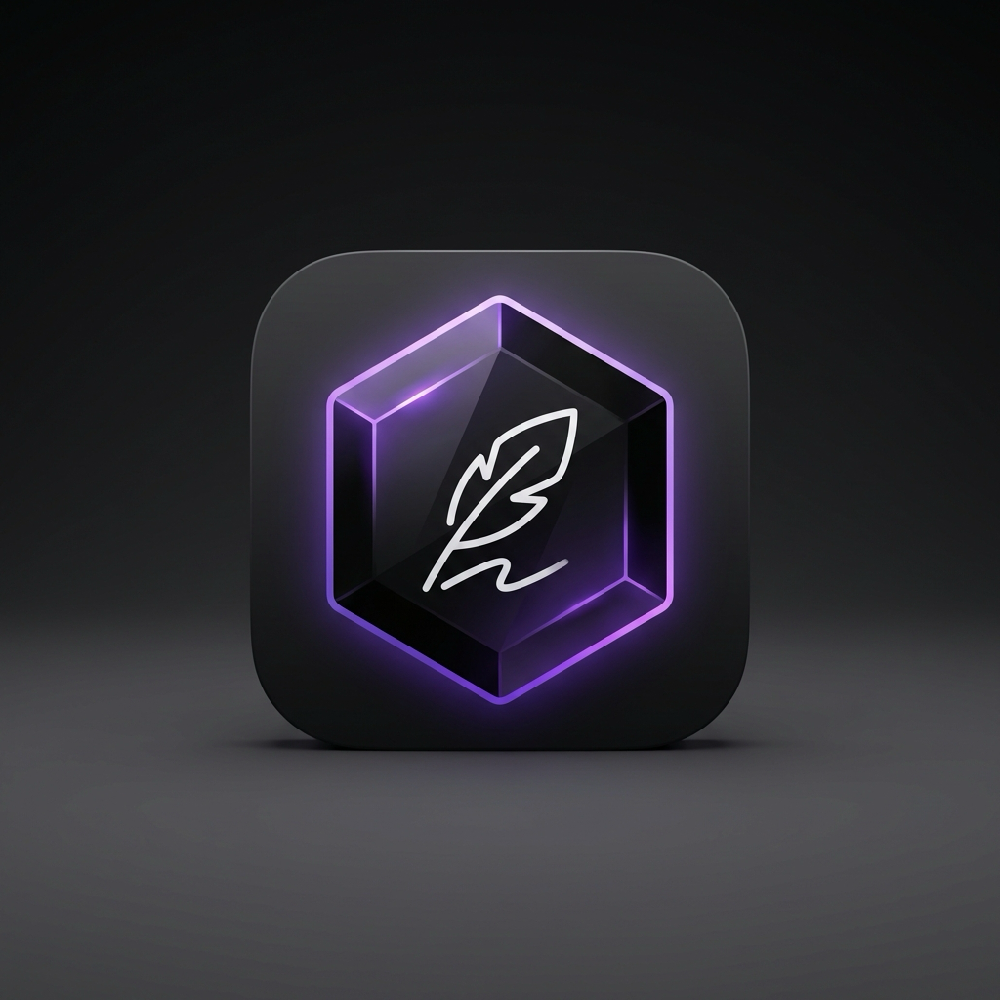
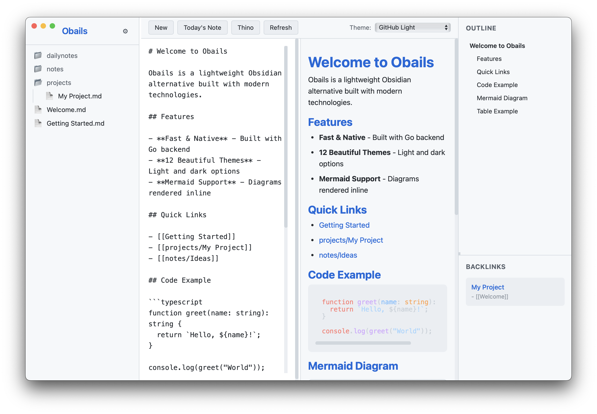

<p align="center">
  
</p>

<h1 align="center">Obails</h1>

<p align="center">
  <strong>Lightweight Obsidian Alternative</strong><br>
  A fast, native markdown editor built with Wails v3 + Go + TypeScript
</p>

<p align="center">
  
  
  
</p>

---

## Features

- **Markdown Editor** - Live preview with syntax highlighting
- **12 Themes** - 5 light + 7 dark themes (GitHub Light, Catppuccin, Dracula, Nord, etc.)
- **Mermaid Diagrams** - Full support with fullscreen view, pan & zoom
- **File Tree Sidebar** - Navigate your vault with ease
- **Outline Panel** - Jump to any heading instantly
- **Backlinks** - See which notes link to the current note
- **Daily Notes** - Quick access to today's note
- **Timeline** - Quick memos with timestamp (`HH:mm content`)
- **Code Highlighting** - Syntax highlighting for code blocks
- **Native Performance** - Built with Go backend, runs as native app

## Screenshots

<p align="center">
  
</p>

*GitHub Light theme with Mermaid diagram support*

## Installation

### Option 1: Download Pre-built Binary (macOS)

1. Download the latest release from [GitHub Releases](https://github.com/kazuph/obails/releases)
2. Unzip `obails-macos.zip`
3. Move `obails.app` to `/Applications`
4. **First launch**: Right-click → "Open" (required for unsigned apps)

> **Note**: This app is not signed with an Apple Developer certificate. macOS will show a security warning on first launch.

### Option 2: Build from Source

**Requirements:**
- Go 1.21+
- Node.js 18+
- pnpm
- [Wails v3](https://v3.wails.io/)

```bash
# Install Wails v3
go install github.com/wailsapp/wails/v3/cmd/wails3@latest

# Clone the repository
git clone https://github.com/kazuph/obails.git
cd obails

# Build the app
wails3 task darwin:package

# Run the app
open bin/obails.app
```

## Usage

### Configuration

Obails stores its configuration at `~/.config/obails/config.toml`:

```toml
[vault]
  path = "/path/to/your/obsidian/vault"

[daily_notes]
  folder = "02_dailynotes"
  format = "2006-01-02"

[timeline]
  section = "## Memos"
  time_format = "15:04"

[editor]
  font_size = 14
  font_family = "SF Mono"
```

### Keyboard Shortcuts

| Shortcut | Action |
|----------|--------|
| `Cmd + ,` | Open settings (config.toml) |
| `Cmd + S` | Save current file |

### Themes

Switch themes from the dropdown in the toolbar. Your selection is saved automatically.

**Light Themes:** GitHub Light, Solarized Light, One Light, Catppuccin Latte, Rosé Pine Dawn

**Dark Themes:** Catppuccin Mocha, Dracula, Nord, Solarized Dark, One Dark, Gruvbox, Tokyo Night

## Development

```bash
# Run in development mode (hot reload)
wails3 dev

# Run E2E tests
pnpm test

# Build for production
wails3 task darwin:package
```

## Tech Stack

- **Backend**: Go + [Wails v3](https://v3.wails.io/)
- **Frontend**: TypeScript + Vite
- **Markdown**: [@mizchi/markdown](https://github.com/nicedoc/markdown)
- **Diagrams**: [Mermaid.js](https://mermaid.js.org/)
- **Syntax Highlighting**: [highlight.js](https://highlightjs.org/)

## Roadmap

- [ ] Full-text search
- [ ] Graph view
- [ ] Timeline view (Twitter-like memo stream)

## License

MIT License - see [LICENSE](LICENSE) for details.

## Credits

- Icon generated with Gemini AI
- Inspired by [Obsidian](https://obsidian.md/)

---

<p align="center">
  Made with love by <a href="https://github.com/kazuph">@kazuph</a>
</p>
