<p align="center">
  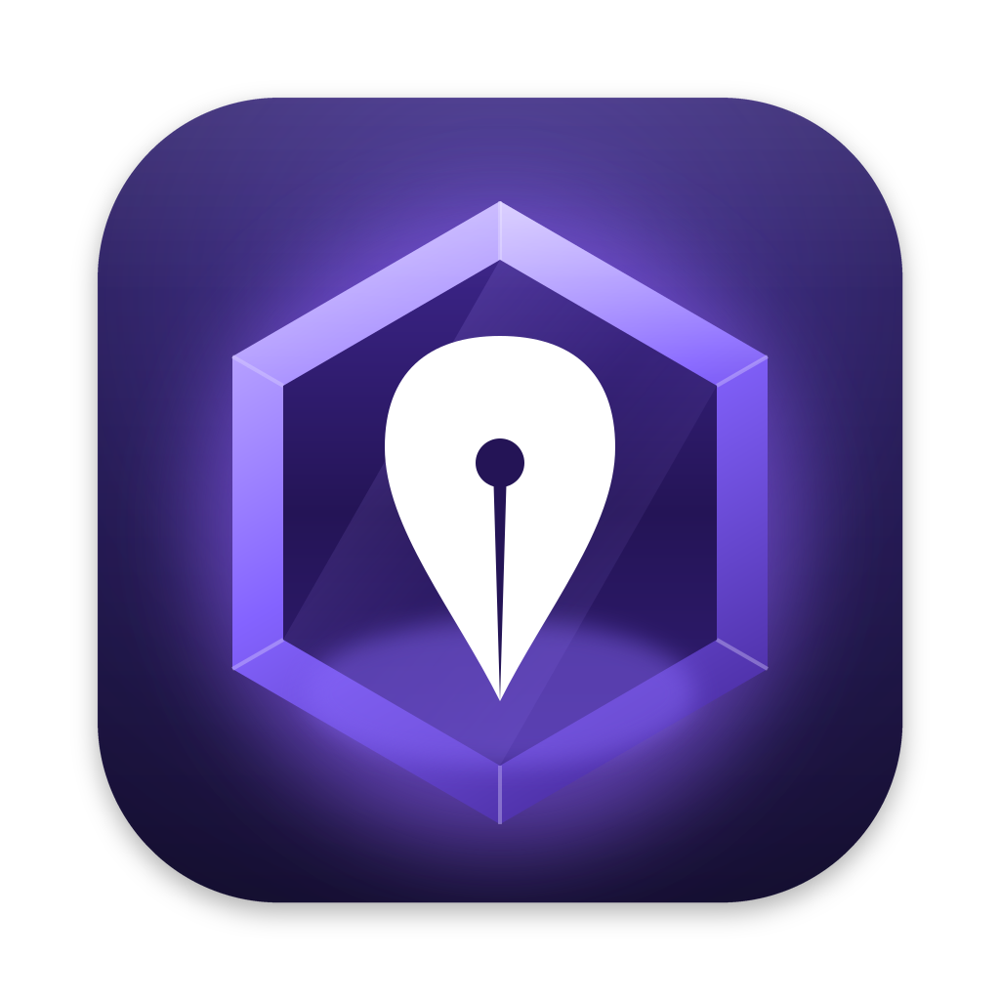
</p>

<h1 align="center">Obails</h1>

<p align="center">
  <strong>Lightweight Obsidian Alternative</strong><br>
  A fast, native markdown editor built with Wails v3 + Go + TypeScript
</p>

<p align="center">
  
  
  
  
</p>

---

## Features

- **Markdown Editor** - Live preview with syntax highlighting
- **12 Themes** - 5 light + 7 dark themes (GitHub Light, Catppuccin, Dracula, Nord, etc.)
- **Mermaid Diagrams** - Full support with fullscreen view, pan & zoom
- **File Tree Sidebar** - Navigate your vault with ease
- **Outline Panel** - Jump to any heading instantly
- **Backlinks** - See which notes link to the current note
- **Vault Search** - Full-text search with Obsidian-compatible operators
- **Daily Notes** - Quick access to today's note
- **Timeline** - Quick memos with timestamp (`HH:mm content`)
- **Code Highlighting** - Syntax highlighting for code blocks
- **Native Performance** - Built with Go backend, runs as native app

## Screenshots

### Main Editor

<p align="center">
  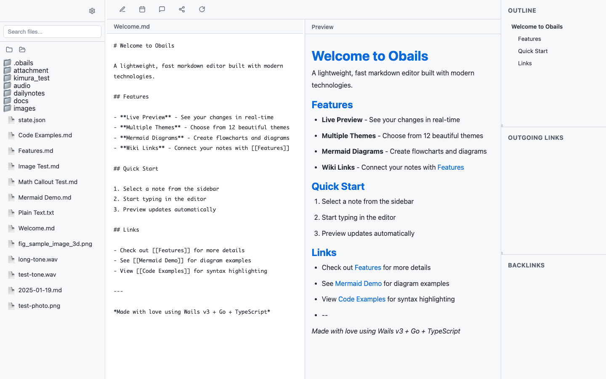
</p>

*GitHub Light theme - Split view with markdown editor and live preview*

<p align="center">
  
</p>

*Dracula theme - Beautiful dark mode for night coding*

### Knowledge Graph

<p align="center">
  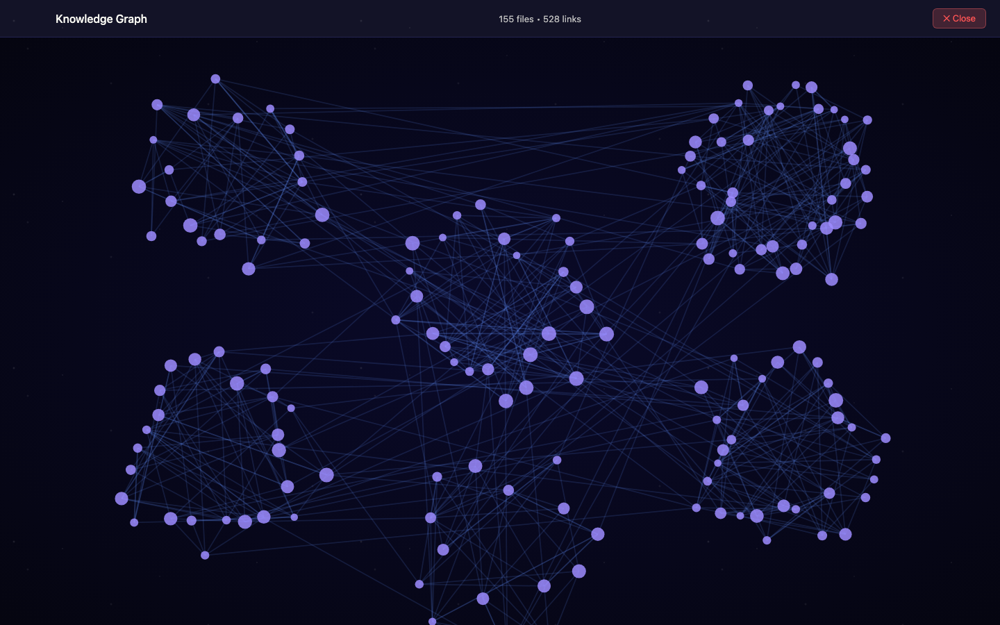
</p>

*Interactive knowledge graph showing connections between notes*

### Mermaid Diagrams

<p align="center">
  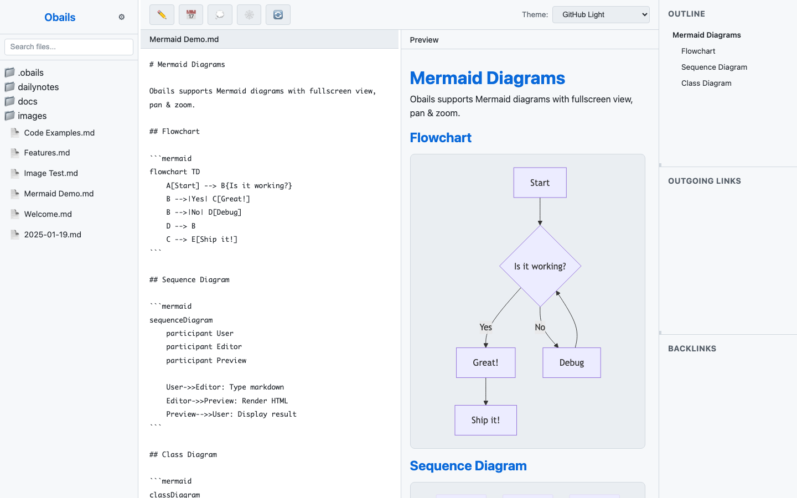
</p>

*Full Mermaid.js support with flowcharts, sequence diagrams, and more*

### Timeline & Daily Notes

<p align="center">
  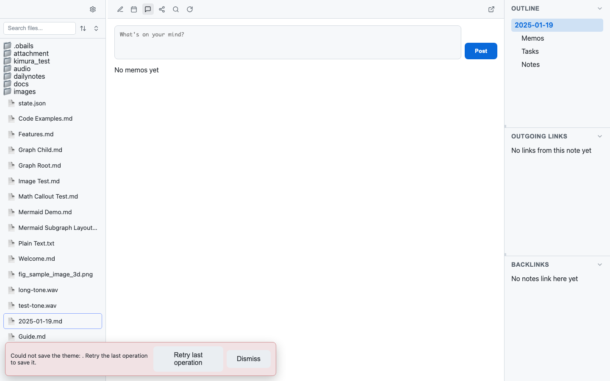
</p>

*Quick memos with timestamps - perfect for daily journaling*

### Code Syntax Highlighting

<p align="center">
  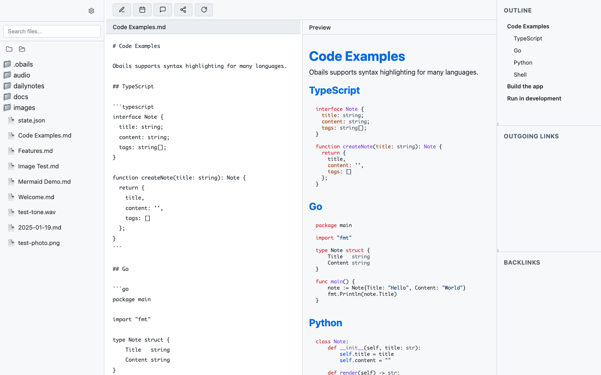
</p>

*Syntax highlighting for TypeScript, Go, Python, and more*

### Theme Gallery

| Light Themes | Dark Themes |
|:---:|:---:|
|  | 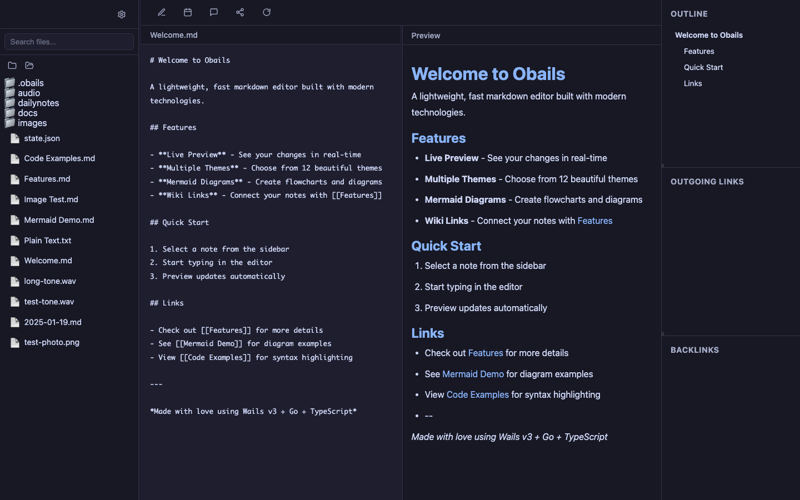 |
| 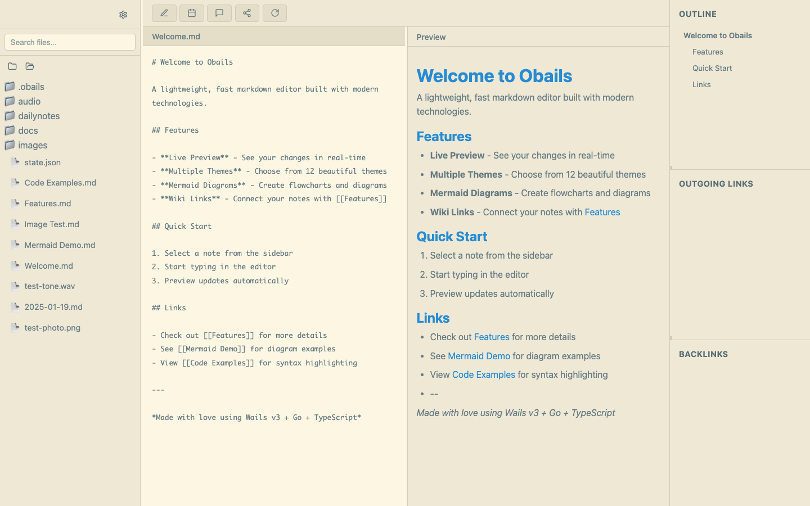 | 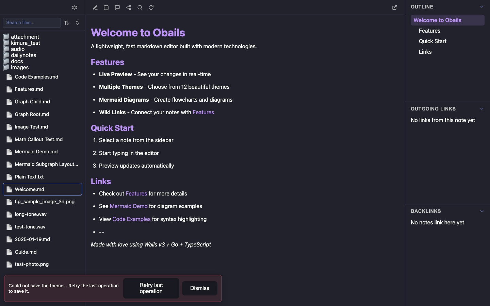 |
| 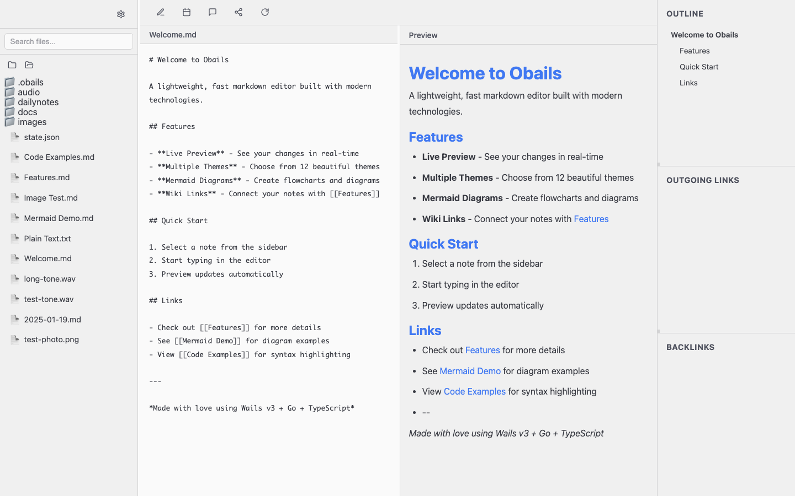 | 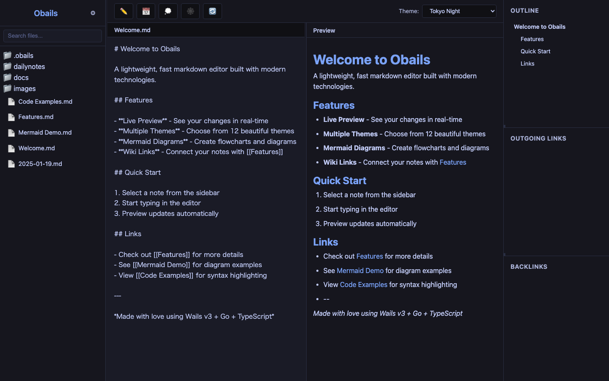 |

## Installation

### Option 1: Homebrew (Apple Silicon, macOS 26 or later)

```bash
brew install --cask kazuph/tap/obails
```

Quit Obails before updating an installed copy:

```bash
brew update
brew upgrade --cask obails
```

This Cask installs `obails.app` in `/Applications`. Notes and settings remain in
place when updating or uninstalling. The bundled speech helper requires macOS 26.
Release 1.1.3 and later are signed with Developer ID and notarized by Apple.

If you already installed Obails manually, quit it and move only
`/Applications/obails.app` to the Trash before running the install command.
Do not remove your vault or `~/.config/obails`.

### Option 2: Download Pre-built Binary (Apple Silicon, macOS 26 or later)

1. Download the latest release from [GitHub Releases](https://github.com/kazuph/obails/releases)
2. Unzip the macOS archive from the release
3. Move `obails.app` to `/Applications`
4. Open `obails.app` normally. macOS may ask you to confirm opening a downloaded app.

### Option 3: Build from Source

**Requirements:**
- Go 1.21+
- Node.js 18+
- pnpm
- [Wails v3](https://v3.wails.io/)

```bash
# Install Wails v3
go install github.com/wailsapp/wails/v3/cmd/wails3@latest

# Clone the repository
git clone https://github.com/kazuph/obails.git
cd obails

# Build the app
wails3 task darwin:package

# Run the app
open bin/obails.app
```

## Usage

### Configuration

Obails stores its configuration at `~/.config/obails/config.toml`:

```toml
[vault]
  path = "/path/to/your/obsidian/vault"

[daily_notes]
  folder = "02_dailynotes"
  format = "2006-01-02"

[timeline]
  section = "## Memos"
  time_format = "15:04"

[editor]
  font_size = 14
  font_family = "SF Mono"
```

### Keyboard Shortcuts

| Shortcut | Action |
|----------|--------|
| `Cmd + ,` | Open settings (config.toml) |
| `Cmd + S` | Save current file |

### Themes

Switch themes from the dropdown in the toolbar. Your selection is saved automatically.

**Light Themes:** GitHub Light, Solarized Light, One Light, Catppuccin Latte, Rosé Pine Dawn

**Dark Themes:** Catppuccin Mocha, Dracula, Nord, Solarized Dark, One Dark, Gruvbox, Tokyo Night

## Development

```bash
# Run in development mode (hot reload)
wails3 dev

# Run E2E tests
pnpm test

# Build for production
wails3 task darwin:package
```

`pnpm test` runs the existing browser suite against Vite, then runs the
note-selection and HTTP boundary tests against the real Wails backend.
Use `pnpm test --grep "Graph View"` to filter the existing browser suite, or
`pnpm test:real` to run the real-backend suite alone. Its evidence is saved under
`test-results/real-backend` and `playwright-report/real-backend`, preserving the
browser suite's results.
The second suite builds and starts Wails with the `e2e` build tag and
`e2e/fixtures/config.e2e.toml`. Its HTTP endpoint listens only on `127.0.0.1:9245`
and is excluded from development and production builds. Stop other servers on
that port before running the suite. The note-selection test uses real file and
binding requests; older tests still have their existing browser test helpers.
The capture script used by the frontend contract tests is tracked at
`e2e/capture-major-features.ts`.

## Tech Stack

- **Backend**: Go + [Wails v3](https://v3.wails.io/)
- **Frontend**: TypeScript + Vite
- **Markdown**: [@mizchi/markdown](https://github.com/nicedoc/markdown)
- **Diagrams**: [Mermaid.js](https://mermaid.js.org/)
- **Syntax Highlighting**: [highlight.js](https://highlightjs.org/)

## Changelog

See [CHANGELOG.md](CHANGELOG.md) for the latest `v1.1.3` signed and notarized Homebrew distribution and earlier release notes.

## Roadmap

- [x] Full-text search
- [x] Graph view
- [x] Timeline view (Twitter-like memo stream)
- [x] Image display (PNG, JPG, GIF, WebP, SVG, BMP, ICO)
- [x] PDF viewer (with PDF.js)
- [x] HTML preview
- [ ] Canvas support
- [ ] Excalidraw support

## License

MIT License - see [LICENSE](LICENSE) for details.

## Credits

- Icon generated with Gemini AI
- Inspired by [Obsidian](https://obsidian.md/)

---

<p align="center">
  Made with love by <a href="https://github.com/kazuph">@kazuph</a>
</p>

## Signed macOS releases

The `Release macOS` GitHub Actions workflow builds, tests, signs, notarizes, and
staples the Apple Silicon app before publishing a versioned ZIP. The workflow
uses the following **kazuph/obails repository secrets**:

- `OBAILS_SIGNING_CERTIFICATE_BASE64`: Developer ID Application identity exported as PKCS#12, then base64 encoded
- `OBAILS_SIGNING_CERTIFICATE_PASSWORD`: password protecting that export
- `OBAILS_NOTARY_KEY_BASE64`: base64 encoded App Store Connect team API private key
- `OBAILS_NOTARY_KEY_ID` and `OBAILS_NOTARY_ISSUER_ID`: identifiers for that key

CI imports the signing identity into a temporary keychain and removes the
keychain and decoded credentials after the job. Secrets are never embedded in
the app or uploaded as release assets. Sagasu's repository and secrets are not
used. Release tags must match the version in `package.json`; update the Homebrew
Cask version and SHA256 only after the notarized ZIP has been published.
