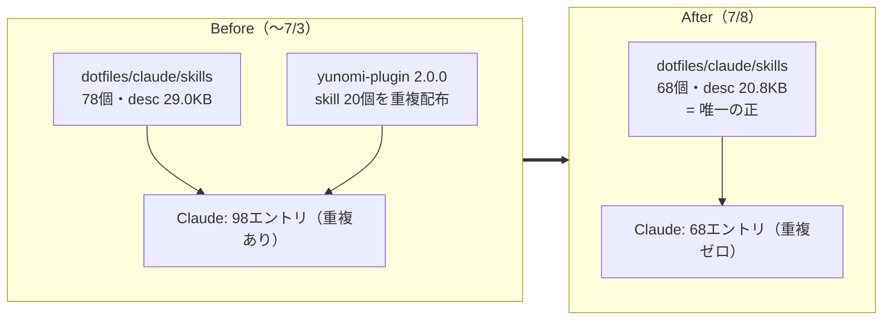

# Mermaid Subgraph Layout Regression

```mermaid
flowchart LR
    subgraph BEFORE["Before（〜7/3）"]
        A1["dotfiles/claude/skills<br/>78個・desc 29.0KB"]
        A2["yunomi-plugin 2.0.0<br/>skill 20個を重複配布"]
        A3["Claude: 98エントリ（重複あり）"]
        A1 --> A3
        A2 --> A3
    end
    subgraph AFTER["After（7/8）"]
        B1["dotfiles/claude/skills<br/>68個・desc 20.8KB<br/>= 唯一の正"]
        B4["Claude: 68エントリ（重複ゼロ）"]
        B1 --> B4
    end
    BEFORE ==> AFTER
```
