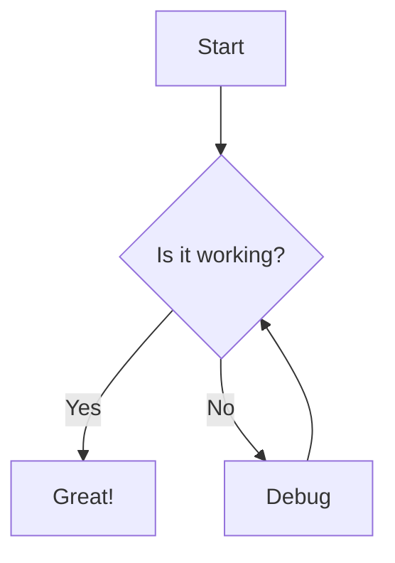

# Welcome to Obails

Obails is a lightweight Obsidian alternative built with modern technologies.

## Features

- **Fast & Native** - Built with Go backend
- **12 Beautiful Themes** - Light and dark options
- **Mermaid Support** - Diagrams rendered inline

## Quick Links

- [[Getting Started]]
- [[projects/My Project]]
- [[notes/Ideas]]

## Code Example

```typescript
function greet(name: string): string {
  return `Hello, ${name}!`;
}

console.log(greet("World"));
```

## Mermaid Diagram



## Table Example

| Feature | Status | Notes |
|---------|--------|-------|
| Editor | Done | Live preview |
| Themes | Done | 12 themes |
| Mermaid | Done | Fullscreen support |
| Search | Planned | Coming soon |
