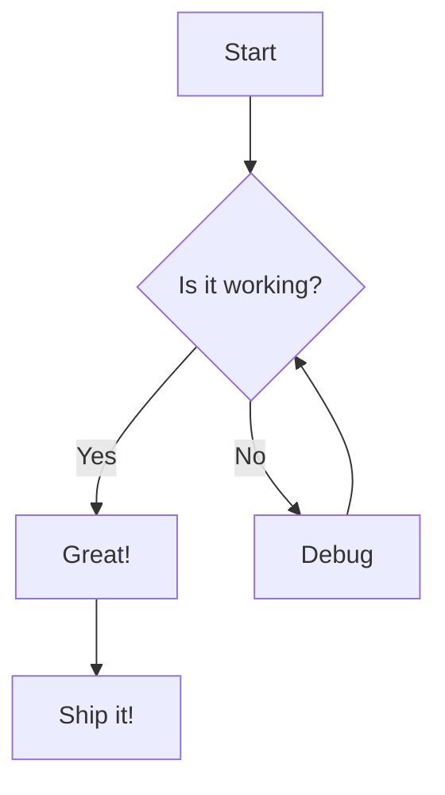
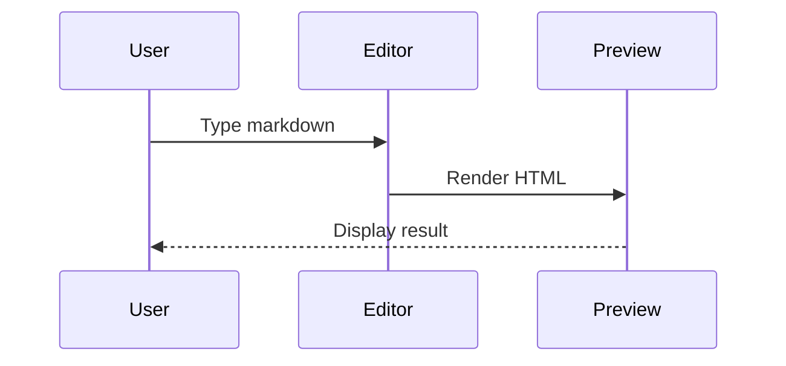
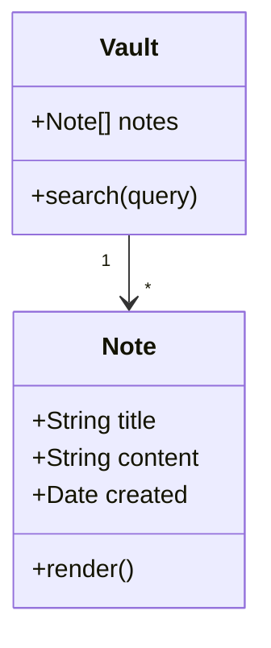

# Mermaid Diagrams

Obails supports Mermaid diagrams with fullscreen view, pan & zoom.

## Flowchart

```mermaid
flowchart TD
    A[Start] --> B{Is it working?}
    B -->|Yes| C[Great!]
    B -->|No| D[Debug]
    D --> B
    C --> E[Ship it!]
```

## Sequence Diagram

```mermaid
sequenceDiagram
    participant User
    participant Editor
    participant Preview

    User->>Editor: Type markdown
    Editor->>Preview: Render HTML
    Preview-->>User: Display result
```

## Class Diagram

```mermaid
classDiagram
    class Note {
        +String title
        +String content
        +Date created
        +render()
    }
    class Vault {
        +Note[] notes
        +search(query)
    }
    Vault "1" --> "*" Note
```

---

See also: [[Welcome]] | [[Features]]
